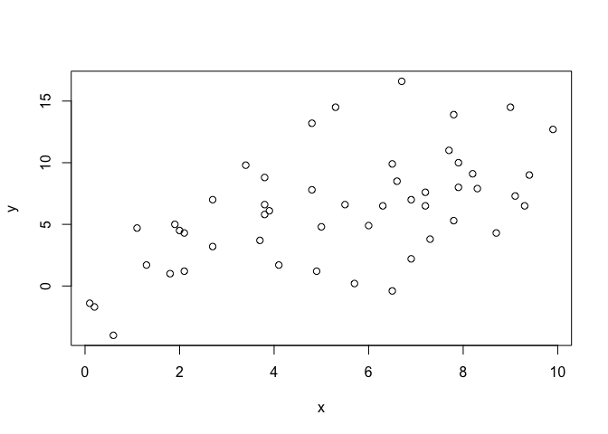
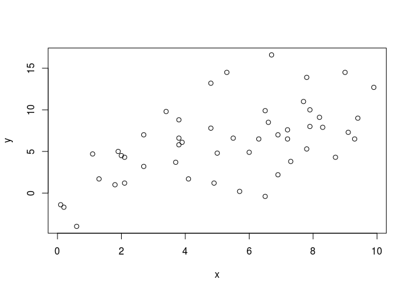

# Constructing function calls (TCRUG-2016-09)
Aaron Rendahl  
September 22, 2016  


# About myself...

# how does one call a function programatically?
with call and do.call

say I have a function to add two numbers

```r
myf <- function(x, y) x + y
myf(1, 1)
```

```
## [1] 2
```

do.call evaluates the function "what", with the arguments "args" (supplied as a list)


```r
args(do.call)
```

```
## function (what, args, quote = FALSE, envir = parent.frame()) 
## NULL
```

```r
do.call(myf, list(1, 1))
```

```
## [1] 2
```

call prepares it but does not evaluate it, and instead takes arguments separately through the ... argument

```r
args(call)
```

```
## function (name, ...) 
## NULL
## <bytecode: 0x7fee01d3cf58>
```

```r
(c1 <- call("myf", 1, 1))
```

```
## myf(1, 1)
```

```r
eval(c1)
```

```
## [1] 2
```

I'll focus on do.call
For better or for worse, I also will ignore the "envir" option which allows the call to be executed in a particular environment.
For better, because it would take longer than I have to address this in enough detail to be meaningful.
For worse because every so often really weird things can happen if you don't understand what this means.

# for split-apply-combine
The most common use (perhaps) is as part of split-apply-combine, as so named and made famous by Hadley Wickham. This is what we used to do before he wrote the plyr package, and still is occassionally useful.

Say we have data that we want to split by group and apply a function to.

Here's a data frame with five groups, 10 observations of a and b for each group

```r
set.seed(5)
d <- data.frame(group=rep(LETTERS[1:5], each=10), a=10 + round(rnorm(50, 1)), b=11 + round(rnorm(50,1)))
## split it by group
ds <- split(d, d$group)
## apply a function to each part that gets mean a, mean b, confidence interval of difference for paired t test
out <- lapply(ds, function(di) with(di, c(mean.a=mean(a), mean.b=mean(b), t.confint=t.test(a, b, paired=TRUE)$conf.int)))
do.call(rbind, out)
```

```
##   mean.a mean.b t.confint1   t.confint2
## A   10.9   12.1  -2.141811 -0.258188870
## B   10.5   11.5  -1.892207 -0.107793183
## C   11.5   12.0  -1.005834  0.005833719
## D   11.1   12.0  -2.267727  0.467727151
## E   11.2   12.2  -1.674445 -0.325555041
```


# more on how it works, with lm 
(because it shows you the call itself in the output)

let's make and plot some data (avoiding dollar signs...)

```r
set.seed(1)
n <- 50
d <- data.frame(x=round(runif(n, 0, 10), 1))
d <- within(d, {
    y <- round(1 + 0.9*x + rnorm(n, 0, 4), 1)
})
with(d, plot(x, y))
```

<!-- -->

normally would fit model like this

```r
lm(y ~ x, data=d)
```

```
## 
## Call:
## lm(formula = y ~ x, data = d)
## 
## Coefficients:
## (Intercept)            x  
##      1.2246       0.9304
```

so with do.call, let's try this...

```r
do.call(lm, list(y~x, data=d))
```

```
## 
## Call:
## (function (formula, data, subset, weights, na.action, method = "qr", 
##     model = TRUE, x = FALSE, y = FALSE, qr = TRUE, singular.ok = TRUE, 
##     contrasts = NULL, offset, ...) 
## {
##     ret.x <- x
##     ret.y <- y
##     cl <- match.call()
##     mf <- match.call(expand.dots = FALSE)
##     m <- match(c("formula", "data", "subset", "weights", "na.action", 
##         "offset"), names(mf), 0L)
##     mf <- mf[c(1L, m)]
##     mf$drop.unused.levels <- TRUE
##     mf[[1L]] <- quote(stats::model.frame)
##     mf <- eval(mf, parent.frame())
##     if (method == "model.frame") 
##         return(mf)
##     else if (method != "qr") 
##         warning(gettextf("method = '%s' is not supported. Using 'qr'", 
##             method), domain = NA)
##     mt <- attr(mf, "terms")
##     y <- model.response(mf, "numeric")
##     w <- as.vector(model.weights(mf))
##     if (!is.null(w) && !is.numeric(w)) 
##         stop("'weights' must be a numeric vector")
##     offset <- as.vector(model.offset(mf))
##     if (!is.null(offset)) {
##         if (length(offset) != NROW(y)) 
##             stop(gettextf("number of offsets is %d, should equal %d (number of observations)", 
##                 length(offset), NROW(y)), domain = NA)
##     }
##     if (is.empty.model(mt)) {
##         x <- NULL
##         z <- list(coefficients = if (is.matrix(y)) matrix(, 0, 
##             3) else numeric(), residuals = y, fitted.values = 0 * 
##             y, weights = w, rank = 0L, df.residual = if (!is.null(w)) sum(w != 
##             0) else if (is.matrix(y)) nrow(y) else length(y))
##         if (!is.null(offset)) {
##             z$fitted.values <- offset
##             z$residuals <- y - offset
##         }
##     }
##     else {
##         x <- model.matrix(mt, mf, contrasts)
##         z <- if (is.null(w)) 
##             lm.fit(x, y, offset = offset, singular.ok = singular.ok, 
##                 ...)
##         else lm.wfit(x, y, w, offset = offset, singular.ok = singular.ok, 
##             ...)
##     }
##     class(z) <- c(if (is.matrix(y)) "mlm", "lm")
##     z$na.action <- attr(mf, "na.action")
##     z$offset <- offset
##     z$contrasts <- attr(x, "contrasts")
##     z$xlevels <- .getXlevels(mt, mf)
##     z$call <- cl
##     z$terms <- mt
##     if (model) 
##         z$model <- mf
##     if (ret.x) 
##         z$x <- x
##     if (ret.y) 
##         z$y <- y
##     if (!qr) 
##         z$qr <- NULL
##     z
## })(formula = y ~ x, data = structure(list(x = c(2.7, 3.7, 5.7, 
## 9.1, 2, 9, 9.4, 6.6, 6.3, 0.6, 2.1, 1.8, 6.9, 3.8, 7.7, 5, 7.2, 
## 9.9, 3.8, 7.8, 9.3, 2.1, 6.5, 1.3, 2.7, 3.9, 0.1, 3.8, 8.7, 3.4, 
## 4.8, 6, 4.9, 1.9, 8.3, 6.7, 7.9, 1.1, 7.2, 4.1, 8.2, 6.5, 7.8, 
## 5.5, 5.3, 7.9, 0.2, 4.8, 7.3, 6.9), y = c(3.2, 3.7, 0.2, 7.3, 
## 4.5, 14.5, 9, 8.5, 6.5, -4, 1.2, 1, 7, 8.8, 11, 4.8, 6.5, 12.7, 
## 6.6, 5.3, 6.5, 4.3, 9.9, 1.7, 7, 6.1, -1.4, 5.8, 4.3, 9.8, 13.2, 
## 4.9, 1.2, 5, 7.9, 16.6, 8, 4.7, 7.6, 1.7, 9.1, -0.4, 13.9, 6.6, 
## 14.5, 10, -1.7, 7.8, 3.8, 2.2)), row.names = c(NA, -50L), .Names = c("x", 
## "y"), class = "data.frame"))
## 
## Coefficients:
## (Intercept)            x  
##      1.2246       0.9304
```

wow, what was that!

two things: 1) function call is passed in as value of argument, and 2) parameters are evaluated before sending to do.call

instead send the function as a character and wrap parameters we don't want evaluated first in "quote", which simply returns its argument when evaluated

```r
do.call("lm", list(y~x, data=quote(d)))
```

```
## 
## Call:
## lm(formula = y ~ x, data = d)
## 
## Coefficients:
## (Intercept)            x  
##      1.2246       0.9304
```

Both, however, give the correct result and can be used later with summary, coef, etc, as needed. The fact that parameters are evaluated first, though, is potentially really handy!

# Programatically fitting models
This is my second main use for do.call, to programatically fit different formulas.

Can store formula in a character variable, itcould be a vector of options that we loop through.

```r
f <- "y ~ x"
## will work without do.call, but call refers to "f"
(m1 <- lm(f, data=d))
```

```
## 
## Call:
## lm(formula = f, data = d)
## 
## Coefficients:
## (Intercept)            x  
##      1.2246       0.9304
```

```r
## do. call instead evaluates the f first, so call is as expected
(m2 <- do.call("lm", list(as.formula(f), data=quote(d))))
```

```
## 
## Call:
## lm(formula = y ~ x, data = d)
## 
## Coefficients:
## (Intercept)            x  
##      1.2246       0.9304
```

doesn't matter in most contexts, but makes me a little nervous sometimes
say we change f, then update the model (not that I use update a lot...)

```r
f <- "y ~ 1"
update(m1)
```

```
## 
## Call:
## lm(formula = f, data = d)
## 
## Coefficients:
## (Intercept)  
##       6.178
```

```r
update(m2)
```

```
## 
## Call:
## lm(formula = y ~ x, data = d)
## 
## Coefficients:
## (Intercept)            x  
##      1.2246       0.9304
```

There are situations when you might want either, I guess, but it feels cleaner to
me to have the actual formula I used stored rather than a generic "f". Though if you think about it, I prefer the opposite for the data argument, so...

### fitting all possible (additive linear) models

```r
set.seed(16)
v <- paste0("x", 1:5)
for(vi in v) {
  d[[vi]] <- round(rnorm(nrow(d), mean=10, sd=2), 1)
}
```


```r
out <- do.call(expand.grid, setNames(rep(list(c(TRUE, FALSE)), length=5), v))
head(out)
```

```
##      x1    x2    x3   x4   x5
## 1  TRUE  TRUE  TRUE TRUE TRUE
## 2 FALSE  TRUE  TRUE TRUE TRUE
## 3  TRUE FALSE  TRUE TRUE TRUE
## 4 FALSE FALSE  TRUE TRUE TRUE
## 5  TRUE  TRUE FALSE TRUE TRUE
## 6 FALSE  TRUE FALSE TRUE TRUE
```

```r
f <- apply(out, 1, function(x) paste(c(1, names(out)[x]), collapse=" + "))
f <- paste("y ~", f)
head(f)
```

```
## [1] "y ~ 1 + x1 + x2 + x3 + x4 + x5" "y ~ 1 + x2 + x3 + x4 + x5"     
## [3] "y ~ 1 + x1 + x3 + x4 + x5"      "y ~ 1 + x3 + x4 + x5"          
## [5] "y ~ 1 + x1 + x2 + x4 + x5"      "y ~ 1 + x2 + x4 + x5"
```

```r
ms <- lapply(f, function(fi) {
  do.call("lm", list(as.formula(fi), data=quote(d)))
})
out$AIC <- sapply(ms, AIC)
summary(ms[[which.min(out$AIC)]])
```

```
## 
## Call:
## lm(formula = y ~ 1 + x1 + x3, data = d)
## 
## Residuals:
##     Min      1Q  Median      3Q     Max 
## -8.2497 -2.1521 -0.1565  2.0469  9.1151 
## 
## Coefficients:
##             Estimate Std. Error t value Pr(>|t|)    
## (Intercept)  18.2044     4.1090   4.430  5.6e-05 ***
## x1           -0.6016     0.3396  -1.771   0.0830 .  
## x3           -0.5869     0.2941  -1.995   0.0518 .  
## ---
## Signif. codes:  0 '***' 0.001 '**' 0.01 '*' 0.05 '.' 0.1 ' ' 1
## 
## Residual standard error: 4.183 on 47 degrees of freedom
## Multiple R-squared:  0.1604,	Adjusted R-squared:  0.1246 
## F-statistic: 4.488 on 2 and 47 DF,  p-value: 0.01646
```

Careful with interpreting results from using the "best" model...
Here it comes out statistically significant at the 0.05 level (though I cherry picked the random seed). How often does this happen by random chance? I used replicate to repeat the above 1000 times; here are the proportion of best models and full models with p<0.05.


```
##  best  full 
## 0.224 0.048
```

## using do.call for optimal use of optim

See also: stats4::mle and bbmle::mle2, which makes some (possibly all) of this unneeded. Still, handy to see how parameters can be passed around from function to function.

making data in global environment
in real life, this would be in a data frame
could explore how to write functions that use variables from within data frame but not today...


```r
rm(list=ls())
set.seed(1)
n <- 50
x <- round(runif(n, 0, 10), 1)
y <- round(1 + 0.9*x + rnorm(n, 0, 4), 1)
plot(x, y)
```

<!-- -->

say we want to find the best linear fit, and standard deviation, assuming
data is normally distributed around linear fit with constant variance

$y_i ~ N(a + bx_i, s^2)$

want to get parameters a, b, and s that maximize corresponding likelihood


```r
m1 <- lm(y ~ x)
summary(m1)
```

```
## 
## Call:
## lm(formula = y ~ x)
## 
## Residuals:
##     Min      1Q  Median      3Q     Max 
## -7.6721 -2.2880 -0.5557  2.0841  9.1418 
## 
## Coefficients:
##             Estimate Std. Error t value Pr(>|t|)    
## (Intercept)   1.2246     1.1680   1.048      0.3    
## x             0.9304     0.1958   4.752 1.87e-05 ***
## ---
## Signif. codes:  0 '***' 0.001 '**' 0.01 '*' 0.05 '.' 0.1 ' ' 1
## 
## Residual standard error: 3.725 on 48 degrees of freedom
## Multiple R-squared:  0.3199,	Adjusted R-squared:  0.3057 
## F-statistic: 22.58 on 1 and 48 DF,  p-value: 1.868e-05
```

I'll report log(s) instead of s itself, so that range can be over whole real line

```r
setNames(c(coef(m1), log(sqrt(sum(residuals(m1)^2)/n))), c("int", "slope", "logsd"))
```

```
##       int     slope     logsd 
## 1.2246150 0.9303879 1.2946861
```

say we want to do this "by hand"
as an example of what to do if had more complex likelihood function
we want to minimize the negative log likelihood

```r
negloglik <- function(int, slope, logsd, x, y) {
    -sum(dnorm(y, mean=int + slope * x, sd=exp(logsd), log=TRUE))
}
```

using optim is an option to do this
but optim wants the parameters as one parameter at the beginning

```r
args(optim)
```

```
## function (par, fn, gr = NULL, ..., method = c("Nelder-Mead", 
##     "BFGS", "CG", "L-BFGS-B", "SANN", "Brent"), lower = -Inf, 
##     upper = Inf, control = list(), hessian = FALSE) 
## NULL
```

### method one
positional, lengthy

```r
nll1 <- function(par, x, y) {
    negloglik(int=par[1], slope=par[2], logsd=par[3], x=x, y=y)
}
optim(par=c(int=1, slope=1, logsd=log(4)), nll1, x=x, y=y)$par
```

```
##       int     slope     logsd 
## 1.2232355 0.9306589 1.2946277
```
### method two
uses do.call to put them in call automatically

```r
nll2 <- function(par, x, y) {
    do.call(negloglik, c(as.list(par), list(x=x, y=y)))
}
optim(par=c(int=1, slope=1, logsd=log(4)), nll2, x=x, y=y)$par
```

```
##       int     slope     logsd 
## 1.2232355 0.9306589 1.2946277
```

## Aside: combining lists

combining lists seems like it should be straightforward
here are two lists, let's combine them

```r
a1 <- list(x=1, y=2)
a2 <- list(a=c(10,11), b=c(11,12))
c(a1, a2)
```

```
## $x
## [1] 1
## 
## $y
## [1] 2
## 
## $a
## [1] 10 11
## 
## $b
## [1] 11 12
```

but this only works if both of the things are lists,
if not, it doesn't do what we want

```r
d <- 1:3
c(a2, d=d)
```

```
## $a
## [1] 10 11
## 
## $b
## [1] 11 12
## 
## $d1
## [1] 1
## 
## $d2
## [1] 2
## 
## $d3
## [1] 3
```

```r
list(a2, d=d)
```

```
## [[1]]
## [[1]]$a
## [1] 10 11
## 
## [[1]]$b
## [1] 11 12
## 
## 
## $d
## [1] 1 2 3
```

```r
c(a2, list(d=d))
```

```
## $a
## [1] 10 11
## 
## $b
## [1] 11 12
## 
## $d
## [1] 1 2 3
```

the other function I used is `as.list`, which takes a vector
and makes it into a list instead. Contrast with just `list`.

```r
a <- c(x=1, y=2)
as.list(a)
```

```
## $x
## [1] 1
## 
## $y
## [1] 2
```

```r
list(a)
```

```
## [[1]]
## x y 
## 1 2
```


### method three
uses do.call to optimize over some, not others
this is really why I learned about this, to be able to profile the likelihood more easily

```r
nll3 <- function(par, x, y, ...) {
    do.call(negloglik, c(as.list(par), list(x=x, y=y), ...))
}
optim(par=c(int=1, slope=1), nll3, x=x, y=y, logsd=log(4))$par
```

```
##       int     slope 
## 1.2243274 0.9305031
```

### method four
more generic, as all parameters could get wrapped into the ...

```r
nll4 <- function(par, ...) {
    do.call(negloglik, c(as.list(par), list(...)))
}
optim(par=c(int=1, slope=1), nll4, x=x, y=y, logsd=log(4))$par
```

```
##       int     slope 
## 1.2243274 0.9305031
```

## more...
OK, now we're going to "show off..."
not that you would choose these for this example
but might be handy in other kinds of circumstances

### method five
a helper function for optim

```r
optimhelp <- function(par, FUN, ...) {
    do.call(FUN, c(as.list(par), list(...)))
}
optim(par=c(int=1, slope=1), optimhelp, FUN=negloglik, x=x, y=y, logsd=log(4))$par
```

```
##       int     slope 
## 1.2243274 0.9305031
```

### method six: factory
a factory to make really generic
ignoring issues with environments and closures right now...

```r
optfactory <- function(FUN) {
    function(par, ...) { do.call(FUN, c(as.list(par), list(...))) }
}

nllpar <- optfactory(negloglik)
optim(par=c(int=1, slope=1), nllpar, x=x, y=y, logsd=log(4))$par
```

```
##       int     slope 
## 1.2243274 0.9305031
```
### method seven, a new version of optim
this automatically allows extra parameters to be sent to optim as well!

```r
optim2 <- function(par, fn, ...) {
    ff <- function(par, ...) { do.call(fn, c(as.list(par), list(...))) }
    optim(par=par, fn=ff, ...)
}
optim2(par=c(int=1, slope=1), fn=negloglik, x=x, y=y, logsd=log(4))$par
```

```
##       int     slope 
## 1.2243274 0.9305031
```

I suppose you could oneliner this too...

```r
optim(par=c(int=1, slope=1), fn=function(par, ...) { do.call(negloglik, c(as.list(par), list(...))) }, x=x, y=y, logsd=log(4))$par
```

```
##       int     slope 
## 1.2243274 0.9305031
```
or, can just include them as parameters,
probably the clearest way to write the code for users

```r
optim2b <- function(par, fn, gr=NULL, ...,
                    method = c("Nelder-Mead", "BFGS", "CG", "L-BFGS-B", "SANN", "Brent"),
                    lower = -Inf, upper = Inf, control = list(), hessian = FALSE) {
    ff <- function(par, ...) { do.call(fn, c(as.list(par), list(...))) }
    optim(par=par, fn=ff, gr=gr, ..., method=method, lower=lower, upper=upper, control=control, hessian=hessian)
}
optim2b(par=c(int=1, slope=1), fn=negloglik, x=x, y=y, logsd=log(4), hessian=TRUE)[c("par", "hessian")]
```

```
## $par
##       int     slope 
## 1.2243274 0.9305031 
## 
## $hessian
##           int    slope
## int    3.1250  16.6375
## slope 16.6375 111.1987
```

or, for kicks, could show how to separate parameters for the two functions

```r
optim2c <- function(par, fn, extra, ...) {
    ff <- function(par, extra) { do.call(fn, c(as.list(par), extra)) }
    optim(par=par, fn=ff, extra=extra, ...)
}
optim2c(par=c(int=1, slope=1), fn=negloglik, extra=list(x=x, y=y, logsd=log(4)), hessian=TRUE)[c("par", "hessian")]
```

```
## $par
##       int     slope 
## 1.2243274 0.9305031 
## 
## $hessian
##           int    slope
## int    3.1250  16.6375
## slope 16.6375 111.1987
```
